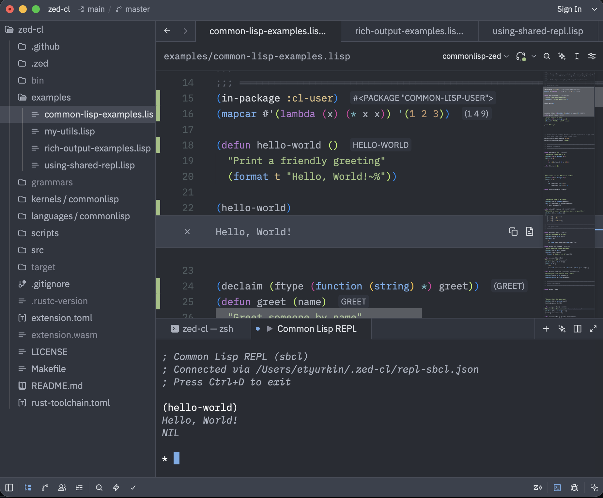

# Common Lisp Extension for Zed

Common Lisp language support for the Zed editor with integrated LSP server and Jupyter kernel support.



## Features

- **LSP Features**: Syntax highlighting, autocomplete, hover documentation, goto-definition
- **Smart Completion**: Type-aware parameter snippets, package-qualified completions
- **Multi-Package Support**: Package labels, user symbols prioritized
- **Interactive REPL**: Built-in REPL with `Ctrl+Shift+Enter`, shared state across files
- **Rich Output**: Display markdown, tables, images, and JSON inline
- **Jupyter Compatible**: Optional Jupyter Lab/Notebook support
- **Cross-Platform**: macOS, Linux, and Windows

## Prerequisites

1. **[Zed](https://zed.dev/download)**
2. **SBCL** on PATH (`sbcl --version` must work in a new terminal). After installing on Windows, fully quit and reopen Zed so it inherits PATH.
   - macOS: `brew install sbcl`
   - Linux: `apt install sbcl` / `dnf install sbcl` / `pacman -S sbcl`
   - Windows: [sbcl.org](http://www.sbcl.org/platform-table.html) (x86-64), or Scoop `scoop install sbcl`
3. **From source only:** [rustup](https://rustup.rs/) with `wasm32-wasip2` (`rustup target add wasm32-wasip2`). Zed loads the WASM `make` produces; it does not compile the extension itself.

ECL is optional (`lisp_impl` in `~/.zed-cl/config.json`) where `sb-bsd-sockets` is available.

Quicklisp is optional. The REPL starts without it; `config.json` is used when `cl-json` is installed.

## Installation

You need two things: the **Zed extension** (`extension.toml` + `extension.wasm` + `languages/`) and **native tools** (`zed-cl-lsp`, `zed-cl-kernel`, `zed-cl-index`, `zed-cl-repl`). Zed does not compile either.

Pick your OS zip:

| Machine | Native zip |
|---|---|
| macOS Apple Silicon | `zed-cl-macos-aarch64.zip` |
| macOS Intel | `zed-cl-macos-x86_64.zip` |
| Linux x86_64 | `zed-cl-linux-x86_64.zip` |
| Windows x86_64 | `zed-cl-windows-x86_64.zip` |

### From a GitHub Release (no Rust, no `make`)

Use this after a tagged release (for example `v1.0.0`).

1. Open [Releases](https://github.com/etyurkin/zed-cl/releases) and download:
   - `zed-cl-extension.zip`
   - the native zip for your machine (table above)
2. Unzip `zed-cl-extension.zip` somewhere you will keep (Zed loads it from that path):
   - macOS / Linux: `~/zed-cl-extension`
   - Windows: `%USERPROFILE%\zed-cl-extension`
3. Unzip the native tools into `~/.zed-cl/bin`:

```bash
mkdir -p ~/.zed-cl/bin
unzip zed-cl-macos-aarch64.zip -d ~/.zed-cl/bin
chmod +x ~/.zed-cl/bin/*
```

Windows (PowerShell):

```powershell
New-Item -ItemType Directory -Force "$env:USERPROFILE\.zed-cl\bin" | Out-Null
Expand-Archive -Force zed-cl-windows-x86_64.zip "$env:USERPROFILE\.zed-cl\bin"
```

4. In Zed: command palette (`Cmd+Shift+P` / `Ctrl+Shift+P`) → `zed: install dev extension` → select the unzipped **extension** folder (it must contain `extension.toml` and `extension.wasm`).
5. Open a `.lisp` file. If the status bar shows a language-server error, run **Restart Server** on `zed-cl`. If eval does not appear, run `repl: refresh kernelspecs`.

You can skip step 3: the extension downloads the native zip from the same release. If that fails, put the binaries in `~/.zed-cl/bin` as above.

### From source

Needs [rustup](https://rustup.rs/) with `wasm32-wasip2` (`rustup target add wasm32-wasip2`).

```bash
git clone https://github.com/etyurkin/zed-cl
cd zed-cl
make build
```

Then in Zed: `zed: install dev extension` → this directory (the one with `extension.toml` and `extension.wasm`). `make` writes native tools to `~/.zed-cl/bin` and copies `extension.wasm` here.

On Windows without Make, build the four native crates with `cargo build --release --manifest-path src/zed-cl-lsp/Cargo.toml` (and kernel/index/repl), copy `*.exe` into `bin\` and `%USERPROFILE%\.zed-cl\bin`, build the WASM crate with `cargo build --release --target wasm32-wasip2 --manifest-path src/zed-cl-extension/Cargo.toml`, copy `zed_commonlisp.wasm` to `extension.wasm`, then install this directory as above.

## Configuration

All configuration is stored in `~/.zed-cl/config.json` using profiles:

```json
{
  "active_profile": "sbcl",
  "profiles": {
    "sbcl": {
      "lisp_impl": "sbcl",
      "system_index": "system-index.db",
      "completion_package_whitelist": [
        "CORE-KEYWORDS",
        "COMMON-LISP",
        "COMMON-LISP-USER"
      ]
    }
  }
}
```

### Profile Settings

Each profile can configure:
- `lisp_impl` - Common Lisp implementation (`"sbcl"` or `"ecl"`)
- `system_index` - System index database filename (in `~/.zed-cl/`)
- `completion_package_whitelist` - Packages to show in completions

### Multiple Profiles

Create different profiles for different workflows:

```json
{
  "active_profile": "sbcl-full",
  "profiles": {
    "sbcl-full": {
      "lisp_impl": "sbcl",
      "system_index": "sbcl-complete.db",
      "completion_package_whitelist": ["CORE-KEYWORDS", "COMMON-LISP", "COMMON-LISP-USER"]
    },
    "ecl-dev": {
      "lisp_impl": "ecl",
      "system_index": "ecl-packages.db",
      "completion_package_whitelist": ["COMMON-LISP", "COMMON-LISP-USER"]
    },
    "minimal": {
      "lisp_impl": "sbcl",
      "system_index": "system-index.db",
      "completion_package_whitelist": ["COMMON-LISP"]
    }
  }
}
```

Switch profiles by changing `active_profile` and restarting Zed.

### Completion Package Whitelist

Control which packages appear in completions. By default (when not set), shows all user-defined packages plus COMMON-LISP and KEYWORD.

Special values:
- `"CORE-KEYWORDS"` - Only core keywords (excludes system keywords)
- `"ALL-KEYWORDS"` - All keywords including system ones

## Using the Extension

### LSP Features

Open any `.lisp` file and get:
- Autocomplete for Common Lisp built-ins and your code
- Hover documentation
- Goto-definition
- Package-aware completions

### Interactive REPL

**Inline evaluation:**
1. Open a `.lisp` file
2. Put the cursor on a form, or select a complete form
3. Press `Ctrl+Shift+Enter` (`repl: run`)
4. See results inline

Zed sends the current line (or the selection). If that line is an incomplete `defun`, the REPL reads **one** top-level form from the file.

**Example files** (shared REPL — eval definitions, then call them from another buffer):
- `examples/common-lisp-examples.lisp` — functions in `CL-USER`
- `examples/my-utils.lisp` — package `MY-UTILS`; eval this before `my-utils:` calls
- `examples/using-shared-repl.lisp` — call those definitions from another file
- `examples/rich-output-examples.lisp` — markdown, tables, images

**Terminal REPL (for development):**
1. Open command palette (`Cmd+Shift+P`)
2. Type "Tasks: Spawn"
3. Select "Common Lisp REPL"
4. Get an interactive REPL in a terminal tab

All evaluations share a single REPL environment - definitions are automatically available in autocomplete.

**Direct terminal connection (advanced):**

```bash
sbcl --script scripts/connect-repl.lisp
```

This connects over TCP (`127.0.0.1`) to the shared master REPL. On Unix, `./scripts/connect-repl.sh` wraps the same script with optional `rlwrap`.

## Building a System Index (Optional)

Goto-definition works out-of-the-box for your workspace code. To enable goto-definition for external libraries (Quicklisp packages, SBCL built-ins, etc.), build a system index.

### Quick Start

After `make build`, the indexer is `~/.zed-cl/bin/zed-cl-index` (also `bin/zed-cl-index` in the clone).

**For SBCL users - index SBCL sources:**
```bash
# Using Makefile (indexes SBCL built-ins)
make build-system-index

# Or manually
~/.zed-cl/bin/zed-cl-index \
  --source-dir /path/to/sbcl/src/code \
  --output ~/.zed-cl/system-index.db \
  --default-package COMMON-LISP
```

**For all users - index Quicklisp packages:**
```bash
# Example: Index Alexandria
zed-cl-index \
  --source-dir ~/quicklisp/dists/quicklisp/software/alexandria-<version> \
  --output ~/.zed-cl/system-index.db \
  --default-package ALEXANDRIA
```

### Finding SBCL Source

**macOS (Homebrew):**
```bash
$(brew --prefix sbcl)/share/sbcl/src
# Usually: /opt/homebrew/share/sbcl/src or /usr/local/share/sbcl/src
```

**Linux:**
```bash
/usr/share/sbcl/src           # Debian/Ubuntu
/usr/share/sbcl-source/src    # Some distributions
```

### Indexer Commands

**Build an index:**
```bash
zed-cl-index \
  --source-dir <PATH>           # Directory containing .lisp files (searches recursively)
  --output <DB_FILE>            # Output database file (appends if exists)
  --default-package <PACKAGE>   # Default package for symbols without (in-package ...)
```

**Query an index:**
```bash
zed-cl-index \
  --query \
  --database <DB_FILE>          # Database to query
  --symbol <SYMBOL>             # Symbol name (e.g., MAPCAR, FORMAT) [required]
  --package <PACKAGE>           # Package name (e.g., SB-IMPL) [optional - searches all packages if omitted]
```

### Examples

**Index SBCL standard library:**
```bash
# Core runtime (list functions, sequences, etc.)
zed-cl-index \
  --source-dir /opt/homebrew/share/sbcl/src/code \
  --output ~/.zed-cl/system-index.db \
  --default-package COMMON-LISP

# CLOS/MOP (classes, methods, generic functions)
zed-cl-index \
  --source-dir /opt/homebrew/share/sbcl/src/pcl \
  --output ~/.zed-cl/system-index.db \
  --default-package COMMON-LISP

# Interpreter
zed-cl-index \
  --source-dir /opt/homebrew/share/sbcl/src/interpreter \
  --output ~/.zed-cl/system-index.db \
  --default-package COMMON-LISP
```

**Index Quicklisp libraries:**
```bash
# Alexandria
zed-cl-index \
  --source-dir ~/quicklisp/dists/quicklisp/software/alexandria-20241012-git \
  --output ~/.zed-cl/system-index.db \
  --default-package ALEXANDRIA

# Iterate
zed-cl-index \
  --source-dir ~/quicklisp/dists/quicklisp/software/iterate-1.5.3 \
  --output ~/.zed-cl/system-index.db \
  --default-package ITERATE
```

**Query the index:**
```bash
# Find MAPCAR in a specific package
zed-cl-index --query \
  --database ~/.zed-cl/system-index.db \
  --package SB-IMPL \
  --symbol MAPCAR

# Output:
# Looking up: SB-IMPL::MAPCAR
#
# Found 1 definition(s):
#
#   [1] function in SB-IMPL
#       File: /opt/homebrew/share/sbcl/src/code/list.lisp
#       Position: line 1388, char 19

# Find MAPCAR in all packages (omit --package)
zed-cl-index --query \
  --database ~/.zed-cl/system-index.db \
  --symbol MAPCAR

# Output:
# Looking up: MAPCAR (in all packages)
#
# Found 1 definition(s) across packages:
#
#   [1] function in SB-IMPL
#       File: /opt/homebrew/share/sbcl/src/code/list.lisp
#       Position: line 1388, char 19
```

### Multiple System Indexes (Advanced)

Create different indexes for different projects:

```bash
# Minimal: Just SBCL core
zed-cl-index \
  --source-dir /path/to/sbcl/src/code \
  --output ~/.zed-cl/system-sbcl-only.db \
  --default-package COMMON-LISP

# Full: SBCL + all your Quicklisp libraries
zed-cl-index \
  --source-dir /path/to/sbcl/src/code \
  --output ~/.zed-cl/system-full.db \
  --default-package COMMON-LISP
# ... add more libraries
```

**Switch between indexes** by changing the `system_index` field in your active profile in `~/.zed-cl/config.json` and restarting the extension.

### How It Works

- **User code**: Automatically indexed when you open/save `.lisp` files → `~/.zed-cl/user-index.db`
- **System libraries**: Manually indexed using `zed-cl-index` → `~/.zed-cl/system-index.db` (or custom name)
- **Goto-definition search order**:
  1. User index (your workspace code)
  2. System index (SBCL + libraries you indexed)

## Development Commands

```bash
# Build
make build          # Build Rust binaries and extension
make dev            # Development mode
make check          # Type check only
make test           # Run tests

# Jupyter
make install-jupyter  # Register kernel for Jupyter
make verify          # Verify SBCL installation

# Maintenance
make clean          # Clean build artifacts
make help           # Show all commands
```

### Process Management (Unix)

**List running processes:**
```bash
# Count each process type
ps aux | grep -c '[z]ed-cl-kernel'      # Count kernels
ps aux | grep -c '[z]ed-cl-lsp'        # Count LSP servers
ps aux | grep -c 'master-repl'         # Count master REPLs

# Show detailed process list
ps aux | grep -E 'zed-cl-kernel|zed-cl-lsp|master-repl' | grep -v grep
```

**Kill processes:**
```bash
# Kill all zed-cl processes
pkill -f 'zed-cl-kernel' && pkill -f 'zed-cl-lsp' && pkill -f 'master-repl'

# Kill individual components
pkill -f 'zed-cl-kernel'        # Kill only kernels
pkill -f 'zed-cl-lsp'          # Kill only LSP
pkill -f 'master-repl'         # Kill only master REPL

# Force kill if needed
pkill -9 -f 'zed-cl-kernel' && pkill -9 -f 'zed-cl-lsp' && pkill -9 -f 'master-repl'
```

## Log Locations

**LSP Server:**
- `~/.zed-cl/logs/lsp.log` - LSP debug logs
- `~/.zed-cl/logs/master-repl.log` - Master REPL logs

**Zed Application:**
- `~/Library/Logs/Zed/Zed.log` (macOS)
- `~/.local/share/zed/logs/Zed.log` (Linux)
- `%LOCALAPPDATA%\Zed\logs\Zed.log` (Windows)

**Database Indexes:**
- `~/.zed-cl/system-index.db` - System libraries (SBCL + manually indexed packages)
- `~/.zed-cl/user-index.db` - User workspace code (auto-indexed)

## Architecture

```
      ┌───────────────────────┐
      │  Master REPL Process  │
      │   (TCP 127.0.0.1)     │
      └──────────┬────────────┘
                 │
       ┌─────────┼──────────┐
       │         │          │
   ┌───▼───┐  ┌──▼───┐  ┌───▼───┐
   │Console│  │ Zed  │  │ Zed   │
   │ REPL  │  │ REPL │  │ LSP   │
   └───────┘  └──────┘  └───────┘
```

All components connect to a single master REPL over TCP on localhost. Code evaluated in any component is immediately available in all others.

## License

MIT

## Links

- [Zed Editor](https://zed.dev/)
- [Common Lisp HyperSpec](http://www.lispworks.com/documentation/HyperSpec/Front/index.htm)
- [SBCL](http://www.sbcl.org/)
